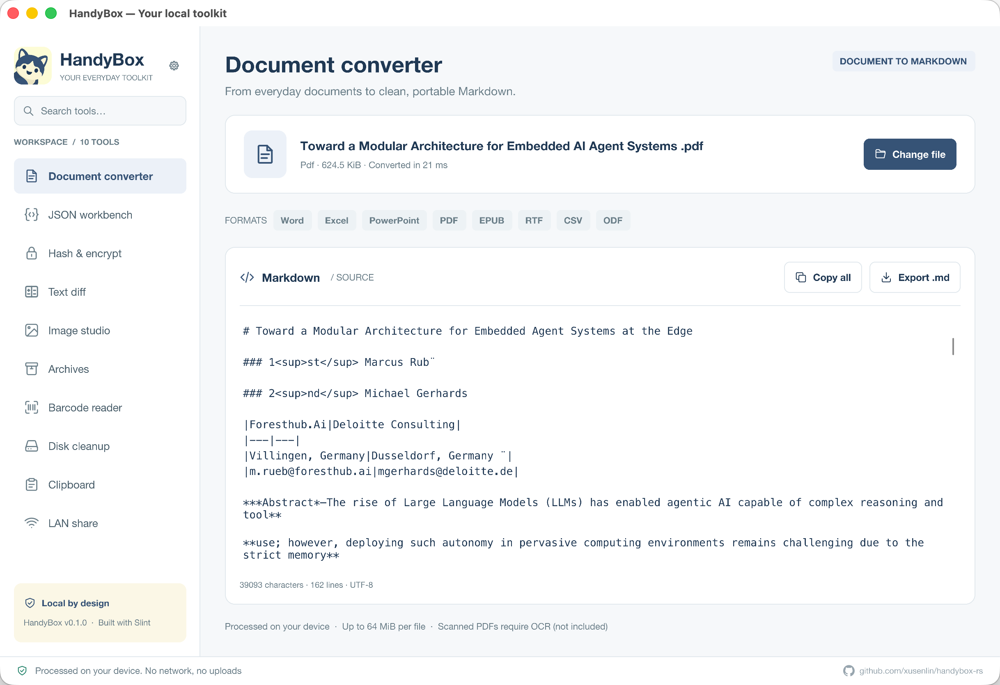
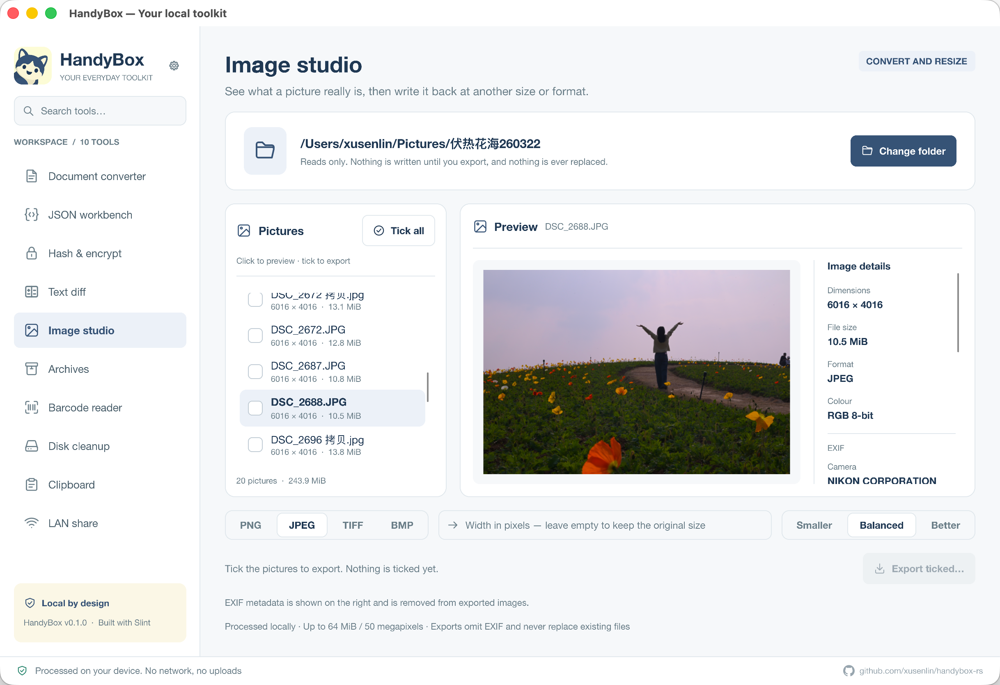
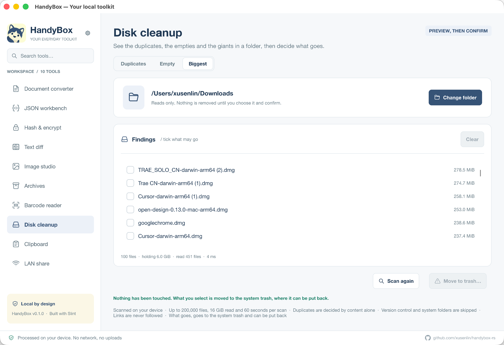
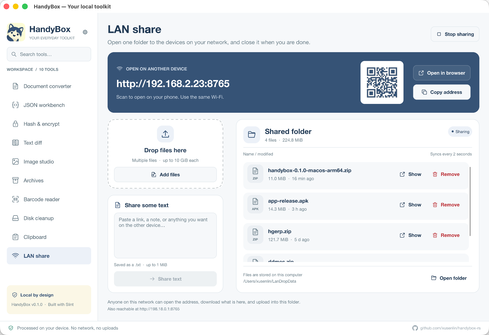

<p align="center">
  
</p>

<h1 align="center">HandyBox</h1>

<p align="center">A fast, native Rust toolbox. No WebView. No extra application runtime.</p>
<p align="center"><strong>English</strong> · <a href="README.zh-CN.md">简体中文</a></p>

HandyBox is an offline-first desktop toolbox built with Rust and Slint for macOS, Windows, and Linux. Convert documents, work with JSON, process images, compare text, and manage files in one application. Switch between English and Simplified Chinese in Settings.

Most tools run entirely on your computer. The optional LAN sharing tool lets you exchange files and text with other devices through a browser, without an account or cloud service.

## Native, fast, and compact

- **Native Rust application:** tool logic is compiled to machine code, with a Slint desktop interface. No Electron, Chromium, or WebView is bundled or required.
- **Built for performance:** GPU rendering with a software fallback, background file processing, and SIMD-accelerated image resizing with a Lanczos3 filter. Release builds enable full LTO, a single codegen unit, and symbol stripping.
- **Fast startup:** around **0.30 s** for a routine launch, measured on a MacBook Pro (Apple M5 Pro, macOS 26.5) from process start to the window's first rendered frame of a release build.
- **No extra application runtime:** packaged builds run without installing Rust, Node.js, Python, Java, or .NET. Windows and Linux packages contain one executable; macOS ships a standard `.app` bundle.
- **Small distribution:** the current local build artifacts have executables around **25–36 MiB** and ZIP downloads around **11–15 MiB**.

### Binary size

Measured from the existing `0.1.0` archives in `dist/`, using **MiB (1,048,576 bytes)**:

| Platform | Executable | ZIP package | Build date |
| --- | ---: | ---: | --- |
| macOS ARM64 | 25.05 MiB | 11.02 MiB | 2026-09-17 |
| Windows x64 | 29.08 MiB | 11.78 MiB | 2026-09-17 |
| Linux x64 | 35.65 MiB | 14.31 MiB | 2026-09-17 |

The macOS executable size excludes the app icon and bundle metadata. These sizes describe the current local packages and may change when the source or toolchain is rebuilt.

“No extra application runtime” still assumes the operating system's libraries and desktop services. The inspected macOS and Windows binaries import system libraries; the Linux binary links to glibc, libm, and libgcc and needs the desktop components described below. The browser page used by LAN sharing opens on the receiving device; the desktop UI itself does not use a WebView.

## Screenshots

| Document conversion | Image studio |
| --- | --- |
|  |  |
| **Disk cleanup** | **LAN sharing** |
|  |  |

## Tools

| Tool | What you can do |
| --- | --- |
| Document converter | Convert Office documents, text-based PDFs, EPUB, RTF, and CSV to Markdown; inspect the source, copy it, or export a `.md` file. |
| JSON workbench | Validate, format, and compact JSON; query and transform data with jq syntax powered by jaq; export results. |
| Hash & encrypt | Calculate and verify SHA-256 / SHA-512 checksums; encrypt and decrypt files with age using a passphrase or recipient key; generate age key pairs. |
| Text diff | Compare text or files side by side, review line changes, and export a unified diff. |
| Image studio | Browse images in a folder, resize, convert to PNG / JPEG / TIFF / BMP, optimize PNG losslessly, and inspect EXIF metadata. |
| Archives | Preview, create, and extract ZIP / 7z archives, with path checks and extraction limits. |
| Barcode reader | Read QR codes and barcodes from images, including Data Matrix, PDF417, Code 128, EAN, and UPC; copy decoded text. |
| Disk cleanup | Find duplicate, empty, and large files; review selected items and move them to the system trash. |
| Clipboard | Collect text, images, and file references; copy items back, export images as PNG, and optionally collect clipboard history during the session. |
| LAN share | Share a folder with devices on the same network; open a browser link or scan a QR code to upload, download, and exchange text. |

## Run from source

Install Rust through rustup and the native build tools for your platform. The repository pins **Rust 1.98.1** in `rust-toolchain.toml`; rustup selects it when you work in this directory.

- **macOS:** install Xcode Command Line Tools with `xcode-select --install`.
- **Windows:** install Visual Studio Build Tools with the Desktop development with C++ workload for the MSVC Rust toolchain.
- **Linux:** install a C/C++ toolchain, `pkg-config`, and desktop development libraries. On Ubuntu / Debian:

  ```sh
  sudo apt-get update
  sudo apt-get install -y build-essential pkg-config \
    libx11-dev libx11-xcb-dev libxcb1-dev \
    libxkbcommon-dev libxkbcommon-x11-dev \
    libgl1-mesa-dev libfontconfig1-dev libwayland-dev
  ```

Then clone and start the application:

```sh
git clone https://github.com/xusenlin/handybox-rs.git
cd handybox-rs
cargo run --locked
```

Linux uses the X11 backend; a Wayland session needs XWayland. Native file dialogs use XDG Desktop Portal, so your desktop also needs a working portal backend.

## Usage

Choose a tool from the sidebar, then open a file or paste content where supported. You can also drag files into the window or pass paths when starting the app:

```sh
# Convert a sample document to Markdown
cargo run --locked -- examples/sample.rtf

# Open the JSON workbench
cargo run --locked -- examples/sample.json

# Read QR codes and barcodes from an image
cargo run --locked -- examples/sample-codes.png

# Compare two text files (replace these paths with your own)
cargo run --locked -- original.txt changed.txt

# Scan a folder with Disk cleanup
cargo run --locked -- /path/to/folder
```

These arguments open the desktop interface. A single image normally opens in the barcode reader, `.json` in the JSON workbench, `.age` in decryption mode, and `.zip` / `.7z` in Archives. Two paths open Text diff.

Drag and drop belongs to the tool on screen, and only to it: no tool starts work on a page you are not looking at. Documents, Hash & encrypt, the JSON workbench and Text diff take files; the barcode reader takes images; Image studio takes images and folders; Archives takes archives and folders to pack; Disk cleanup takes folders; and Text diff takes two files at once as a comparison. If the tool on screen cannot use what you dropped, it says so instead of sending the file elsewhere.

While the LAN share page is showing and sharing is running, dropped files — a whole selection at a time — are added to the shared folder. Folders have to be compressed first, and nothing is added while sharing is stopped.

### Share with another device

1. Open **LAN share** and choose a folder. The default is `~/LanDropData`.
2. Click **Start sharing**.
3. Connect the other device to the same network, then open the displayed address or scan its QR code.
4. Upload or download files, or send text, which is saved as a `.txt` file.
5. Click **Stop sharing** when finished.

Sharing is off by default. The server uses HTTP without sign-in or transport encryption; devices that can reach its address can read shared files and upload content. Use it on a trusted network. It starts at port `8765` and tries up to `8785` if ports are occupied. If another device cannot connect, check firewall access and network client isolation.

Only files directly inside the selected folder are shared; subfolders, hidden files, and symbolic links are excluded. Compress folders before sharing. Each uploaded file is limited to **10 GiB**, and each text submission to **1 MiB**.

### Current limits

- **Documents:** inputs up to 64 MiB. Scanned or image-only PDFs that require OCR are not supported.
- **JSON:** inputs up to 4 MiB. Queries use jaq's jq syntax implementation.
- **Images:** inputs up to 64 MiB and 50 million pixels. WebP and GIF can be read; output formats are PNG, JPEG, TIFF, and BMP.
- **Archives:** password-protected content cannot be extracted, and only the compression methods enabled in this build are supported. Input archives are limited to 2 GiB, and extracted output to 16 GiB.
- **Clipboard:** automatic collection is off by default. History stays in memory, holds up to 60 items / 128 MiB, and is cleared when the window closes.
- **Disk cleanup:** removal requires confirmation and uses the system trash. Scan limits may produce partial results for very large folders.

## Build and package

Build an optimized executable:

```sh
cargo build --release --locked
```

The executable is `target/release/handybox` (`handybox.exe` on Windows).

The optional Task workflow packages release archives into `dist/`. Install the `task` command to use these tasks:

| Command | Result / requirements |
| --- | --- |
| `task run` | Run the app; forward arguments with `task run -- examples/sample.rtf`. |
| `task build:native` | Package the host build; macOS produces a ZIP containing `HandyBox.app`. Packaging scripts require a Unix-style shell and system archive tools. |
| `task build:cross` | Build Windows x64 and Linux x64 ZIPs using a running Docker daemon. |
| `task build` | Run on macOS to build the host macOS package plus Windows x64 and Linux x64 packages, and generate `dist/SHA256SUMS`. Requires Docker. |

The macOS package follows the host architecture. It uses an ad-hoc signature and is not notarized; if macOS blocks a downloaded copy you trust, allow that app in **System Settings → Privacy & Security** after attempting to open it.

### Renderer troubleshooting

If the application has graphics startup or rendering issues, force software rendering:

```sh
# macOS / Linux
SLINT_BACKEND=winit-software cargo run --locked
```

```powershell
# Windows PowerShell
$env:SLINT_BACKEND = "winit-software"
cargo run --locked
```

## Development

```sh
cargo fmt --all -- --check
cargo test --workspace --locked
cargo clippy --workspace --all-targets --locked -- -D warnings
```

The same checks run in CI on macOS, Windows, and Linux. Task aliases are `task test` and `task check`.

```text
crates/
  handybox-core/          Tool logic and tests
    web/                 Browser interface for LAN sharing
  handybox-desktop/       Desktop application
    src/controllers/     UI state and actions
    src/worker/          Background work and platform integration
    ui/                  Slint pages, components, and translations
assets/                  Application icons
docs/screenshots/
  en/                    English screenshots
  zh-CN/                 Simplified Chinese screenshots
examples/                Sample documents, JSON, and barcode image
scripts/                 Packaging scripts and cross-build Dockerfile
```

The core crate keeps tool logic separate from the desktop UI. Slint provides the interface; background workers handle file processing and platform operations. See [Cargo.toml](Cargo.toml) and the crate manifests for dependency details.
