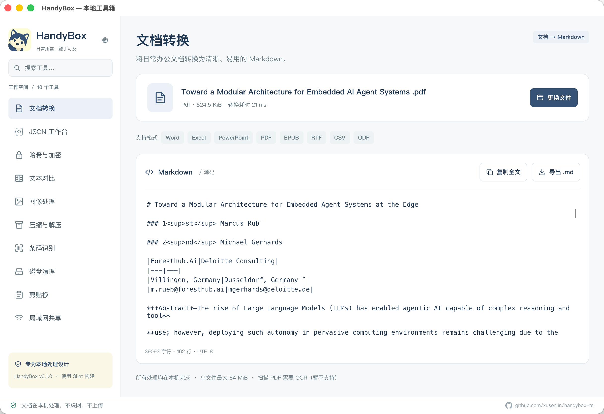
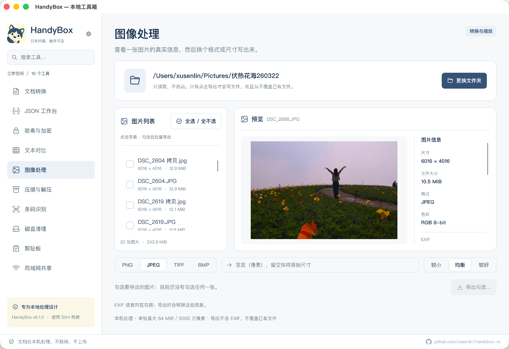
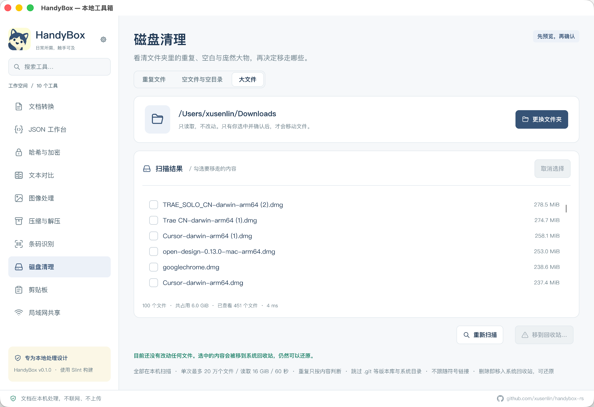
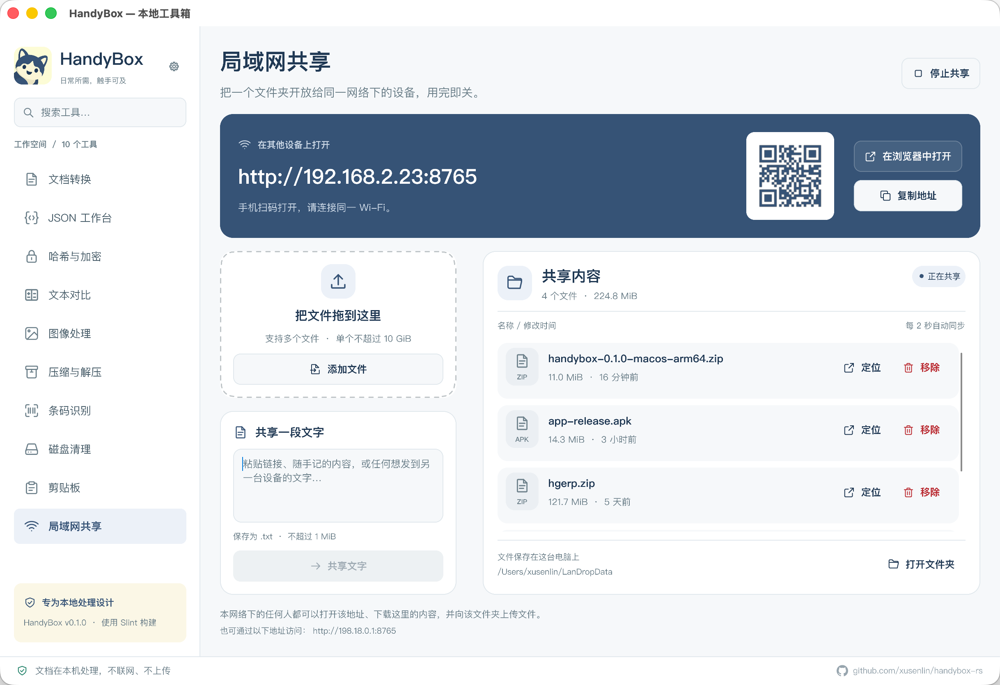

<p align="center">
  
</p>

<h1 align="center">HandyBox</h1>

<p align="center">高性能的原生 Rust 工具箱，无需 WebView，无需额外应用运行时。</p>
<p align="center"><a href="README.md">English</a> · <strong>简体中文</strong></p>

HandyBox 是一个使用 Rust 和 Slint 构建、以离线使用为主的桌面工具箱，面向 macOS、Windows 和 Linux。文档转换、JSON 处理、图片处理、文本对比和文件管理，都可以在同一个应用中完成。界面支持在设置中切换简体中文和英文。

大多数工具完全在本机运行。按需开启的局域网共享工具，还能让其他设备通过浏览器与电脑交换文件和文字，无需账号或云服务。

## 原生、高性能、小体积

- **原生 Rust 应用：** 工具逻辑编译为机器码，桌面界面使用 Slint；无需打包或安装 Electron、Chromium、WebView。
- **围绕性能构建：** GPU 渲染与软件渲染回退，后台处理文件，使用 SIMD 加速图片缩放和 Lanczos3 滤波；Release 构建启用完整 LTO、单代码生成单元和符号剥离。
- **启动快：** 日常启动约 **0.30 秒**，在 MacBook Pro（Apple M5 Pro，macOS 26.5）上实测 Release 构建，计时自进程启动到窗口画出第一帧。
- **无需额外应用运行时：** 使用打包版本无需安装 Rust、Node.js、Python、Java 或 .NET。Windows 和 Linux 包内只有一个可执行文件，macOS 提供标准 `.app` 应用包。
- **轻量分发：** 当前本地构建产物的可执行文件约 **25–36 MiB**，ZIP 下载包约 **11–15 MiB**。

### 二进制体积

以下数据实测自 `dist/` 中已有的 `0.1.0` 压缩包，单位为 **MiB（1,048,576 字节）**：

| 平台 | 可执行文件 | ZIP 压缩包 | 构建日期 |
| --- | ---: | ---: | --- |
| macOS ARM64 | 25.05 MiB | 11.02 MiB | 2026-09-17 |
| Windows x64 | 29.08 MiB | 11.78 MiB | 2026-09-17 |
| Linux x64 | 35.65 MiB | 14.31 MiB | 2026-09-17 |

macOS 可执行文件大小不包含应用图标和包元数据。这些数据来自当前本地打包产物；重新构建源码或更换工具链后，体积可能变化。

“无需额外应用运行时”仍以操作系统自带库和桌面服务为基础。已检查的 macOS、Windows 二进制导入系统库；Linux 二进制链接 glibc、libm、libgcc，并需要下文说明的桌面组件。局域网共享的网页由接收设备的浏览器打开，桌面界面本身不使用 WebView。

## 界面截图

| 文档转换 | 图片处理 |
| --- | --- |
|  |  |
| **磁盘清理** | **局域网共享** |
|  |  |

## 功能

| 工具 | 可以做什么 |
| --- | --- |
| 文档转换 | 将 Office 文档、文本型 PDF、EPUB、RTF 和 CSV 转为 Markdown，查看源码、复制内容或导出 `.md` 文件。 |
| JSON 工作台 | 校验、格式化和压缩 JSON，通过 jaq 提供的 jq 语法查询、筛选和转换数据，并导出结果。 |
| 哈希与加密 | 计算和校验 SHA-256 / SHA-512；使用 age 通过口令或接收方公钥加密、解密文件，生成 age 密钥对。 |
| 文本对比 | 并排比较文本或文件，查看逐行变化，导出 unified diff。 |
| 图片工坊 | 浏览文件夹中的图片、调整尺寸、转换为 PNG / JPEG / TIFF / BMP、无损优化 PNG、查看 EXIF 信息。 |
| 压缩包 | 预览、创建和解压 ZIP / 7z，内置路径检查和解压大小限制。 |
| 条码识别 | 从图片读取二维码和条形码，包括 Data Matrix、PDF417、Code 128、EAN、UPC 等，支持复制识别结果。 |
| 磁盘清理 | 查找重复文件、空文件和大文件，检查选中项后移入系统废纸篓或回收站。 |
| 剪贴板 | 收集文字、图片和文件引用，重新复制已有内容、导出 PNG，并可按需开启会话内自动收集。 |
| 局域网共享 | 向同一网络中的设备共享文件夹，通过浏览器地址或二维码上传、下载文件和交换文字。 |

## 从源码运行

通过 rustup 安装 Rust，并准备对应平台的本机构建工具。仓库在 `rust-toolchain.toml` 中固定使用 **Rust 1.88.0**，进入项目目录后 rustup 会选择该版本。

- **macOS：** 执行 `xcode-select --install` 安装 Xcode Command Line Tools。
- **Windows：** 使用 MSVC Rust 工具链时，安装 Visual Studio Build Tools，并勾选“使用 C++ 的桌面开发”工作负载。
- **Linux：** 安装 C/C++ 工具链、`pkg-config` 和桌面开发库。Ubuntu / Debian 可执行：

  ```sh
  sudo apt-get update
  sudo apt-get install -y build-essential pkg-config \
    libx11-dev libx11-xcb-dev libxcb1-dev \
    libxkbcommon-dev libxkbcommon-x11-dev \
    libgl1-mesa-dev libfontconfig1-dev libwayland-dev
  ```

克隆项目并启动：

```sh
git clone https://github.com/xusenlin/handybox-rs.git
cd handybox-rs
cargo run --locked
```

Linux 使用 X11 后端，在 Wayland 会话中需要 XWayland。原生文件对话框使用 XDG Desktop Portal，桌面环境还需提供可用的 portal 后端。

## 使用方式

从侧边栏选择工具，打开文件或在支持的工具中粘贴内容。也可以把文件拖入窗口，或在启动时传入路径：

```sh
# 将示例文档转换为 Markdown
cargo run --locked -- examples/sample.rtf

# 打开 JSON 工作台
cargo run --locked -- examples/sample.json

# 识别图片中的二维码和条形码
cargo run --locked -- examples/sample-codes.png

# 对比两个文本文件（替换为自己的文件路径）
cargo run --locked -- original.txt changed.txt

# 使用磁盘清理扫描文件夹
cargo run --locked -- /path/to/folder
```

这些参数会打开桌面界面。单张图片通常进入条码识别，`.json` 进入 JSON 工作台，`.age` 进入解密模式，`.zip` / `.7z` 进入压缩包工具；传入两个路径则打开文本对比。

拖放只属于当前在前台的工具：不会有工具在你看不见的页面上开始工作。文档转换、哈希与加密、JSON 工作台、文本对比接收文件；条码识别接收图片；图片工坊接收图片和文件夹；压缩包工具接收压缩包和待打包文件夹；磁盘清理接收文件夹；文本对比一次拖入两个文件即为一次比较。若当前工具用不上拖入的内容，会直接提示，而不会把文件转交给别的工具。

在局域网共享页面且已开始共享时，拖入的文件会整批加入共享文件夹。文件夹需先压缩；未开始共享时不会写入任何文件。

### 与其他设备共享

1. 打开**局域网共享**，选择文件夹，默认位置为 `~/LanDropData`。
2. 点击**开始共享**。
3. 将其他设备连接到同一网络，在浏览器打开显示的地址，或扫描二维码。
4. 上传、下载文件，或发送文字；文字会保存为 `.txt` 文件。
5. 使用完毕后点击**停止共享**。

共享默认关闭。服务使用 HTTP，没有登录验证和传输加密；能访问该地址的设备可以读取共享文件并上传内容，请在可信任的网络中使用。默认端口为 `8765`，被占用时会依次尝试，最高到 `8785`。其他设备无法连接时，可检查防火墙权限及网络是否开启了客户端隔离。

只共享所选文件夹直属的文件，不包含子文件夹、隐藏文件和符号链接。文件夹请先压缩再分享。单个上传文件上限为 **10 GiB**，单次文字提交上限为 **1 MiB**。

### 当前限制

- **文档转换：** 输入文件最大 64 MiB，不支持需要 OCR 的扫描版或纯图片 PDF。
- **JSON：** 输入最大 4 MiB，查询使用 jaq 实现的 jq 语法。
- **图片处理：** 输入最大 64 MiB、5,000 万像素；可以读取 WebP 和 GIF，输出格式为 PNG、JPEG、TIFF 和 BMP。
- **压缩包：** 不支持提取密码保护的内容，仅支持当前构建启用的压缩算法；输入压缩包最大 2 GiB，解压输出最大 16 GiB。
- **剪贴板：** 自动收集默认关闭；历史只保存在内存中，最多保留 60 条 / 128 MiB，关闭窗口即清空。
- **磁盘清理：** 移除前需要确认，文件进入系统废纸篓或回收站；扫描超大文件夹时可能因扫描上限只返回部分结果。

## 构建与打包

构建优化后的可执行文件：

```sh
cargo build --release --locked
```

产物为 `target/release/handybox`，Windows 下为 `handybox.exe`。

项目还提供可选的 Task 工作流，将发布压缩包输出到 `dist/`。安装 `task` 命令后可使用：

| 命令 | 用途与要求 |
| --- | --- |
| `task run` | 运行应用，通过 `task run -- examples/sample.rtf` 传入参数。 |
| `task build:native` | 打包当前主机版本；macOS 生成包含 `HandyBox.app` 的 ZIP。打包脚本需要 Unix 风格 shell 和系统归档工具。 |
| `task build:cross` | 通过正在运行的 Docker 构建 Windows x64 和 Linux x64 ZIP。 |
| `task build` | 在 macOS 上构建当前主机架构的 macOS 包，以及 Windows x64、Linux x64 包，并生成 `dist/SHA256SUMS`；需要 Docker。 |

macOS 包的架构与构建主机一致，使用临时签名（ad-hoc），尚未公证。如果 macOS 拦截了你信任的下载版本，可在尝试打开后，到**系统设置 → 隐私与安全性**中允许该应用运行。

### 渲染问题排查

遇到图形初始化失败或渲染异常时，可以强制使用软件渲染：

```sh
# macOS / Linux
SLINT_BACKEND=winit-software cargo run --locked
```

```powershell
# Windows PowerShell
$env:SLINT_BACKEND = "winit-software"
cargo run --locked
```

## 开发

```sh
cargo fmt --all -- --check
cargo test --workspace --locked
cargo clippy --workspace --all-targets --locked -- -D warnings
```

CI 会在 macOS、Windows 和 Linux 上运行相同检查，也可使用 `task test` 和 `task check`。

```text
crates/
  handybox-core/          工具逻辑与测试
    web/                 局域网共享的浏览器界面
  handybox-desktop/       桌面应用
    src/controllers/     界面状态与操作
    src/worker/          后台任务与平台集成
    ui/                  Slint 页面、组件与翻译
assets/                  应用图标
docs/screenshots/
  en/                    英文截图
  zh-CN/                 简体中文截图
examples/                示例文档、JSON 与条码图片
scripts/                 打包脚本与交叉编译 Dockerfile
```

核心 crate 将工具逻辑与桌面界面分离；Slint 负责界面，后台 worker 处理文件操作和平台交互。依赖详情见 [Cargo.toml](Cargo.toml) 及各 crate 的清单文件。
